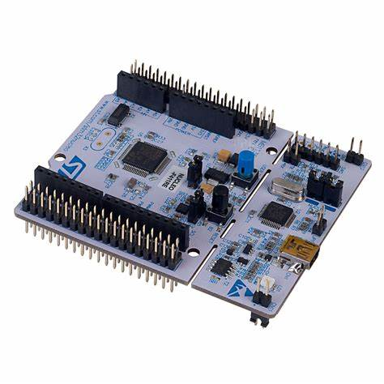

# Embedded_MicroPython_Drivers_-_Firmware
Drivers and Firmwares: 
1. I2C, 
2. SPI, 
3. UART, 
4. Watchdog Timers, 
5. Realtime clock, 
6. External button interrupts 

# Development Board:  
 Drivers were tested on the STM32F4 (NUCLOE-F411 Development Board)  
 
